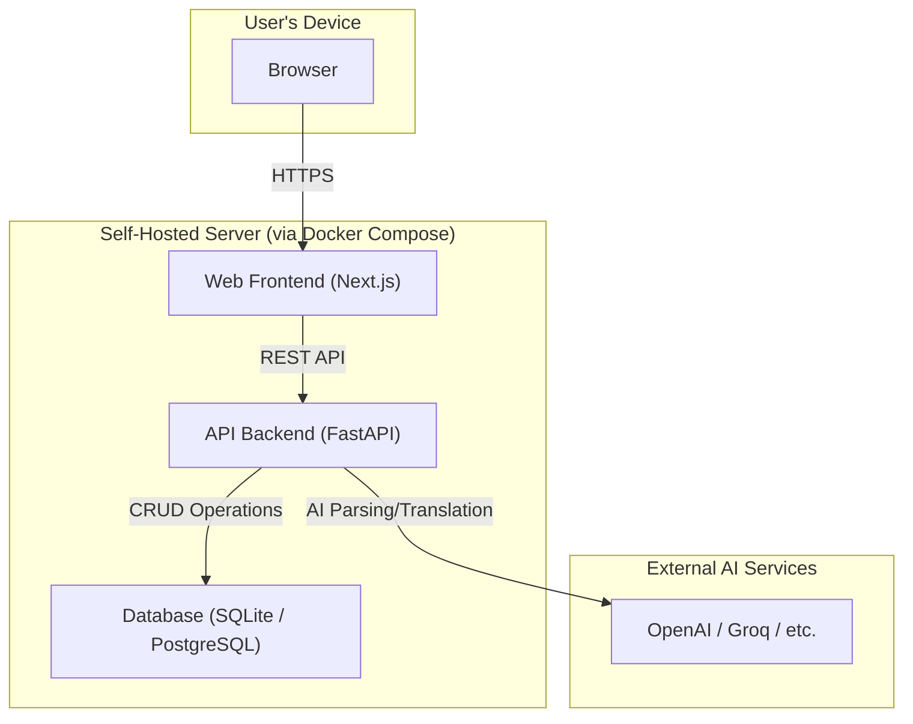

<div align="center"><a name="readme-top"></a>

# WordNest

Your Personal AI Vocabulary Nest<br/>
Transform learning from passive recording to active construction.

**English** · [简体中文](./README.zh-CN.md) · **[Report a Bug][github-issues-link]** · **[Request a Feature][github-issues-link]**

<!-- SHIELD GROUP -->
<!-- TODO: Replace `Caelinya/WordNest` with your actual repo path -->
[![][github-license-shield]][github-license-link]
[![][github-stars-shield]][github-stars-link]
[![][github-forks-shield]][github-forks-link]
[![][github-issues-shield]][github-issues-link]<br/>
[![][github-action-test-shield]][github-action-test-link]

</div>

<details>
<summary><kbd>Table of Contents</kbd></summary>

- [👋🏻 Why I Built WordNest?](#-why-i-built-wordnest)
- [💡 Use Cases](#-use-cases)
- [✨ Key Features](#-key-features)
- [🏗️ Architecture](#️-architecture)
- [🚀 Getting Started: Self-Hosting](#-getting-started-self-hosting)
- [🛣️ Development Roadmap](#️-development-roadmap)
- [🤝 Contributing](#-contributing)
- [📝 License](#-license)

<br/>

</details>

## 👋🏻 Why I Built WordNest?

In an era of information overload, we encounter vast amounts of knowledge daily. However, traditional learning methods often stop at scattered notes and passive memorization, leading to valuable insights being quickly forgotten.

**WordNest** was born to fundamentally change this. It's not just another note-taking app or vocabulary builder; it's a **personalized, AI-powered intelligent knowledge base** tailored for you. Its core mission is to help you efficiently transform fragmented information into a coherent, long-term knowledge system that is truly yours.

<div align="right">
  <a href="#readme-top">Back to top</a>
</div>

## 💡 Use Cases

WordNest is designed for anyone who wants to internalize knowledge into a tangible skill:

*   **👨‍🎓 Students & Language Learners**
    Systematically organize class notes and textbook content, moving beyond clutter. Combined with scientific memory algorithms, prepare for exams efficiently and genuinely expand your vocabulary and sentence patterns.

*   **👩‍💻 Professionals & Researchers**
    Quickly digest industry reports and academic papers to build a knowledge base in your professional field. Seamlessly convert reading input into practical output.

*   **🌱 Lifelong Learners**
    Provides a powerful engine for any explorer wishing to consolidate daily reading and learning into a long-term, systematic body of knowledge.

<div align="right">
  <a href="#readme-top">Back to top</a>
</div>

## ✨ Key Features

| Feature | Description | Status |
| :--- | :--- | :--: |
| **Intelligent Capture** | Supports manual entry and document parsing (PDF/Word), with AI auto-extracting key terms and examples. | ✅ |
| **Structured KB** | Notes are auto-classified by AI into words/phrases/sentences, deduplicated, linked, and taggable. | ✅ |
| **Scientific Memory Engine** | Built-in Spaced Repetition System (SRS) based on the FSRS algorithm for personalized review schedules. | 🏃‍♂️ |
| **Data Sovereignty** | Fully self-hostable, giving you complete control over your data. Configure your own AI keys for flexibility. | 🏃‍♂️ |

*Status: ✅ Implemented | 🏃‍♂️ In Progress | ✨ Planned*

<div align="right">
  <a href="#readme-top">Back to top</a>
</div>

## 🏗️ Architecture

WordNest uses a modern tech stack with a decoupled front-end and back-end, containerized for deployment with Docker.



<div align="right">
  <a href="#readme-top">Back to top</a>
</div>

## 🚀 Getting Started: Self-Hosting

Thanks to Docker, you can have your own instance of WordNest up and running in minutes.

### Prerequisites

1.  An environment that can run Docker (PC / NAS / VPS).
2.  `Git` and `Docker Compose` installed.

### Deployment Steps

1.  **Clone the repository:**
    ```bash
    git clone https://github.com/Caelinya/WordNest.git
    cd WordNest
    ```

2.  **Configure your environment:**
    Copy the environment file template and modify it to your needs. You'll need to at least provide an API Key for an AI service.
    ```bash
    cp .env.example .env
    nano .env
    ```

3.  **Start with one command:**
    ```bash
    docker compose up --build
    ```
    Once it's running, open your browser to `http://localhost:3000` to get started.

<div align="right">
  <a href="#readme-top">Back to top</a>
</div>

## 🛣️ Development Roadmap

The project is under active development. Here is the public roadmap.

#### **✅ Phase 0 & 1: Infrastructure & Core MVP**
- [x] Project containerization (Docker) complete.
- [x] User authentication and full note CRUD implemented.
- [x] AI translation service integrated.

#### **🏃‍♂️ Phase 2: Injecting the Smart Core (In Progress)**
- [x] **AI Note Structuring**: AI auto-classifies notes into "word," "phrase," or "sentence."
- [x] **AI Document Parsing**: Implemented file uploads with AI-powered keyword extraction.
- [ ] **SRS Algorithm Integration**: Introducing the `py-fsrs` memory algorithm for scientific reviews.
- [ ] **Frontend Review Flow**: Developing an interactive flashcard interface.

#### **✨ Phase 3: Productization & Public Beta (Planned)**
- [ ] **Performance & UX Optimization**: Adding caching, skeleton UIs, and global notifications.
- [ ] **User Settings & Data Management**: Supporting custom AI keys and data export.
- [ ] **Production Deployment**: Providing production-ready deployment configurations and more detailed docs.

<div align="right">
  <a href="#readme-top">Back to top</a>
</div>

## 🤝 Contributing

This is an open-source project initiated by an individual, and community contributions are highly welcome and encouraged. Whether it's reporting a bug, proposing a new feature, improving documentation, or writing code, your help is greatly appreciated.

Please check out our [Issues][github-issues-link] page to see what's currently being worked on or to open a new issue.

<div align="right">
  <a href="#readme-top">Back to top</a>
</div>

## 📝 License

This project is licensed under the [Apache 2.0 License](./LICENSE).

---

<!-- LINK GROUP -->
<!-- TODO: Replace `Caelinya/WordNest` with your actual repo path -->
[github-license-link]: https://github.com/Caelinya/WordNest/blob/main/LICENSE
[github-release-link]: https://github.com/Caelinya/WordNest/releases
[github-issues-link]: https://github.com/Caelinya/WordNest/issues
[github-action-test-link]: https://github.com/Caelinya/WordNest/actions/workflows/docker-build-test.yml
[github-forks-link]: https://github.com/Caelinya/WordNest/network/members
[github-stars-link]: https://github.com/Caelinya/WordNest/stargazers

<!-- Shields -->
[github-action-test-shield]: https://img.shields.io/github/actions/workflow/status/Caelinya/WordNest/docker-build-test.yml?label=CI&labelColor=black&logo=githubactions&logoColor=white&style=flat-square
[github-forks-shield]: https://img.shields.io/github/forks/Caelinya/WordNest?color=8ae8ff&labelColor=black&style=flat-square
[github-issues-shield]: https://img.shields.io/github/issues/Caelinya/WordNest?color=ff80eb&labelColor=black&style=flat-square
[github-license-shield]: https://img.shields.io/github/license/Caelinya/WordNest?color=white&labelColor=black&style=flat-square
[github-stars-shield]: https://img.shields.io/github/stars/Caelinya/WordNest?color=ffcb47&labelColor=black&style=flat-square
