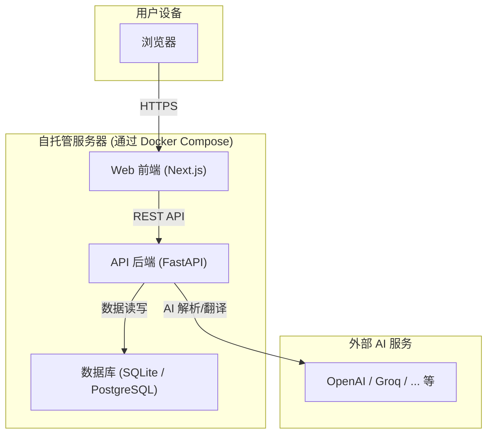

<div align="center"><a name="readme-top"></a>

# WordNest

你的个人 AI 词汇巢<br/>
将学习，从被动记录，转变为主动构建。

[English](./README.md) · **简体中文** · **[报告 Bug][github-issues-link]** · **[功能建议][github-issues-link]**

<!-- SHIELD GROUP -->
<!-- TODO: Replace `Caelinya/WordNest` with your actual repo path -->
[![][github-license-shield]][github-license-link]
[![][github-stars-shield]][github-stars-link]
[![][github-forks-shield]][github-forks-link]
[![][github-issues-shield]][github-issues-link]<br/>
[![][github-action-test-shield]][github-action-test-link]

</div>

<details>
<summary><kbd>目录</kbd></summary>

- [👋🏻 缘起：为何构建 WordNest？](#-缘起为何构建-wordnest)
- [💡 典型用例](#-典型用例)
- [✨ 核心功能](#-核心功能)
- [🏗️ 技术架构](#️-技术架构)
- [🚀 快速上手：自托管](#-快速上手自托管)
- [🛣️ 开发路线图](#️-开发路线图)
- [🤝 欢迎参与贡献](#-欢迎参与贡献)
- [📝 许可证](#-许可证)

<br/>

</details>

## 👋🏻 缘起：为何构建 WordNest？

在信息爆炸的时代，我们每天都会接触到海量的知识。然而，传统的学习方式往往止步于零散的摘抄和被动的记忆，这些宝贵的知识点很快就会被遗忘。

**WordNest** 的诞生，就是为了彻底改变这一现状。它并非又一个简单的笔记软件或背单词应用，而是一个为您量身打造的、由 AI 驱动的**个性化智能知识库**。它的核心使命，是帮助您将碎片化的信息，高效地转化为真正属于您自己的、可以长期调用的知识体系。

<div align="right">
  <a href="#readme-top">返回顶部</a>
</div>

## 💡 典型用例

WordNest 致力于服务于每一位希望将知识内化为能力的人：

*   **👨‍🎓 学生与语言学习者**
    系统性地整理课堂笔记、教材内容，告别杂乱。结合科学的记忆算法，高效备考，真正扩充词汇量和句式储备。

*   **👩‍💻 专业人士与研究人员**
    快速消化行业报告、学术论文，构建自己专业领域的知识体系。将阅读输入，无缝转化为能力输出。

*   **🌱 终身学习者**
    为任何希望将日常阅读和学习，沉淀为长期、系统化知识的探索者，提供一个强大的引擎。

<div align="right">
  <a href="#readme-top">返回顶部</a>
</div>

## ✨ 核心功能

| 功能 (Feature) | 描述 (Description) | 状态 |
| :--- | :--- | :--: |
| **智能捕获** | 支持手动录入和文档（PDF/Word等）解析，AI 自动提取核心词汇和例句。 | ✅ |
| **结构化知识库** | 笔记被 AI 自动分类为单词/词组/句子，并进行去重和关联，支持标签化管理。 | ✅ |
| **科学记忆引擎** | 内置基于 FSRS 算法的间隔重复系统，提供个性化复习计划和多种互动复习模式。 | 🏃‍♂️ |
| **数据主权** | 支持完全私有化部署，用户数据由自己掌控。允许配置自己的 AI 服务密钥，灵活控制成本。 | 🏃‍♂️ |

*状态：✅ 已实现 | 🏃‍♂️ 开发中 | ✨ 计划中*

<div align="right">
  <a href="#readme-top">返回顶部</a>
</div>

## 🏗️ 技术架构

WordNest 采用现代化的技术栈，前后端分离，并通过 Docker 实现容器化部署。



<div align="right">
  <a href="#readme-top">返回顶部</a>
</div>

## 🚀 快速上手：自托管

得益于 Docker，你可以在几分钟内拥有一个完全属于自己的 WordNest 实例。

### 你需要准备

1.  一个可以运行 Docker 的环境 (PC / NAS / VPS)。
2.  安装好 `Git` 和 `Docker Compose`。

### 部署步骤

1.  **克隆仓库：**
    ```bash
    git clone https://github.com/Caelinya/WordNest.git
    cd WordNest
    ```

2.  **配置环境：**
    复制一份环境文件模板，并根据你的需求修改，至少需要填入一个 AI 服务商的 API Key。
    ```bash
    cp .env.example .env
    nano .env
    ```

3.  **一键启动：**
    ```bash
    docker compose up --build
    ```
    启动成功后，在浏览器访问 `http://localhost:3000` 即可开始使用。

<div align="right">
  <a href="#readme-top">返回顶部</a>
</div>

## 🛣️ 开发路线图

项目正在积极开发中，这是当前的公开路线图。

#### **✅ 阶段 0 & 1: 基础设施与核心 MVP**
- [x] 完成了项目容器化 (Docker)。
- [x] 实现了用户认证和笔记的完整 CRUD。
- [x] 集成了 AI 翻译服务。

#### **🏃‍♂️ 阶段 2: 智能核心注入 (进行中)**
- [x] **AI 笔记结构化**: AI 自动将笔记分为“单词”、“词组”或“句子”。
- [x] **AI 文档解析**: 实现文件上传，AI 提取核心词汇。
- [ ] **SRS 算法集成**: 引入 `py-fsrs` 记忆算法，实现科学复习。
- [ ] **前端复习流程**: 开发交互式的卡片复习界面。

#### **✨ 阶段 3: 产品化与公测 (未来规划)**
- [ ] **性能与体验优化**: 引入缓存、加载动画和全局消息提示。
- [ ] **用户设置与数据管理**: 支持自定义 AI Key 和数据导出。
- [ ] **生产环境部署**: 提供生产级的部署配置和更详细的文档。

<div align="right">
  <a href="#readme-top">返回顶部</a>
</div>

## 🤝 欢迎参与贡献

这是一个由个人发起的开源项目，非常欢迎并期待社区的贡献。无论是报告 Bug、提出新功能、改进文档还是编写代码，都对项目非常有帮助。

请查看我们的 [Issues][github-issues-link] 页面，了解当前正在进行的工作或提出新的 Issue。

<div align="right">
  <a href="#readme-top">返回顶部</a>
</div>

## 📝 许可证

本项目基于 [Apache 2.0 License](./LICENSE) 许可证。

---

<!-- LINK GROUP -->
<!-- TODO: Replace `Caelinya/WordNest` with your actual repo path -->
[github-license-link]: https://github.com/Caelinya/WordNest/blob/main/LICENSE
[github-release-link]: https://github.com/Caelinya/WordNest/releases
[github-issues-link]: https://github.com/Caelinya/WordNest/issues
[github-action-test-link]: https://github.com/Caelinya/WordNest/actions/workflows/docker-build-test.yml
[github-forks-link]: https://github.com/Caelinya/WordNest/network/members
[github-stars-link]: https://github.com/Caelinya/WordNest/stargazers

<!-- Shields -->
[github-action-test-shield]: https://img.shields.io/github/actions/workflow/status/Caelinya/WordNest/docker-build-test.yml?label=CI&labelColor=black&logo=githubactions&logoColor=white&style=flat-square
[github-forks-shield]: https://img.shields.io/github/forks/Caelinya/WordNest?color=8ae8ff&labelColor=black&style=flat-square
[github-issues-shield]: https://img.shields.io/github/issues/Caelinya/WordNest?color=ff80eb&labelColor=black&style=flat-square
[github-license-shield]: https://img.shields.io/github/license/Caelinya/WordNest?color=white&labelColor=black&style=flat-square
[github-stars-shield]: https://img.shields.io/github/stars/Caelinya/WordNest?color=ffcb47&labelColor=black&style=flat-square
